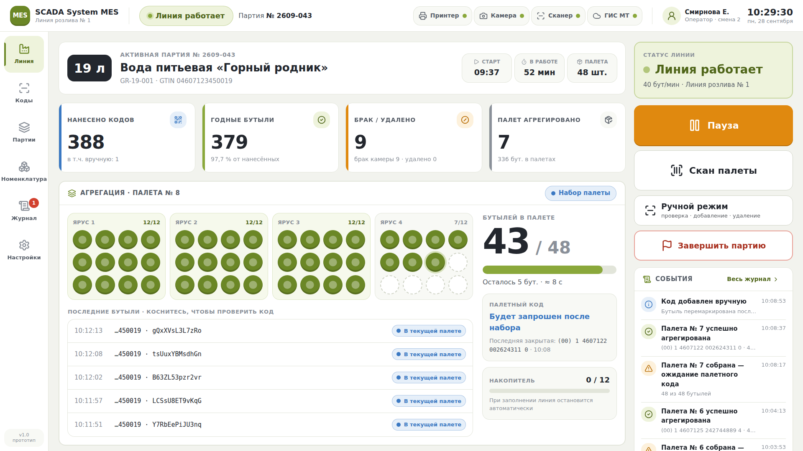
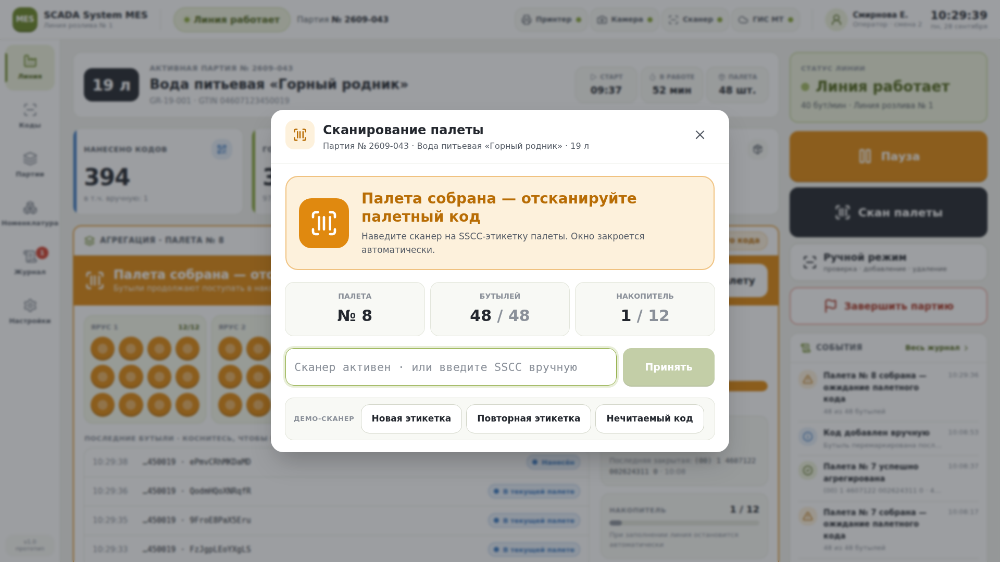
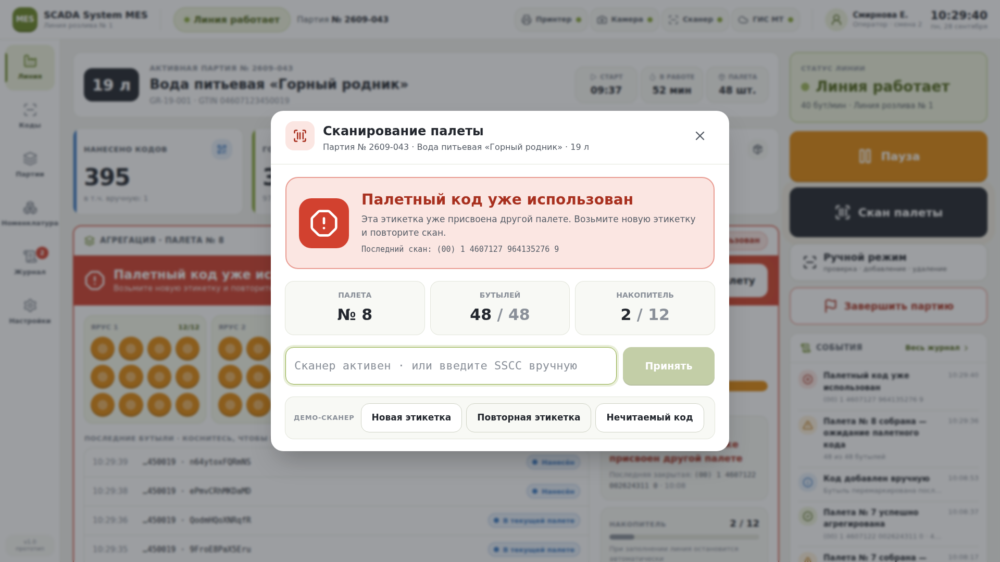
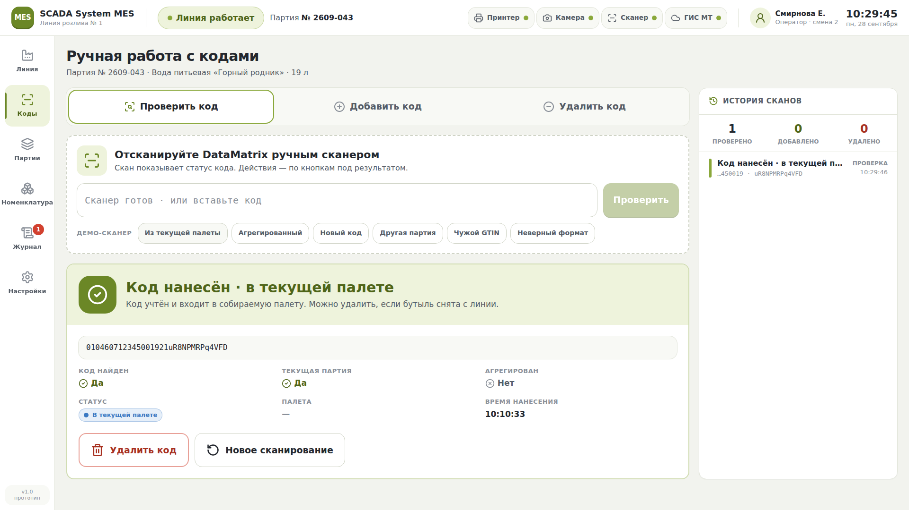
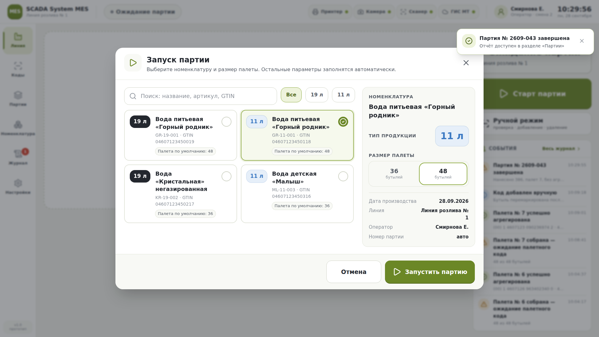
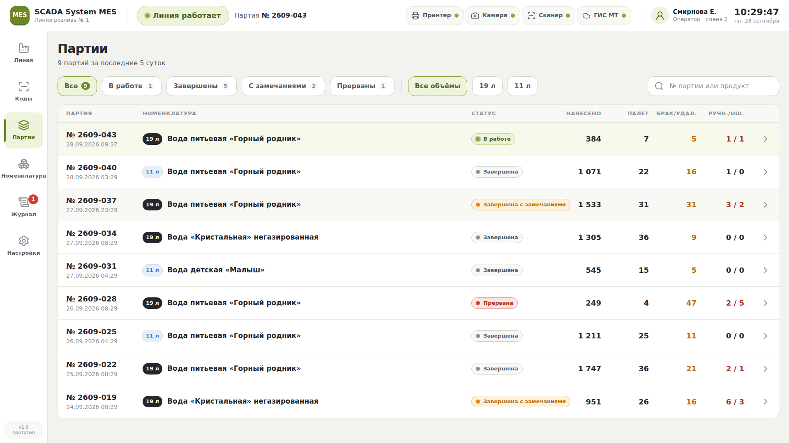

# SCADA System MES: интерфейс оператора линии маркировки

Проектное предложение по UX/UI для MES линии розлива бутылей **19 л и 11 л**: контроль нанесения DataMatrix («Честный знак») и агрегация бутылей в палеты по **36 или 48** штук.

Вместе с документом сделан кликабельный прототип на Next.js. Он лежит в этом же репозитории, открывается по адресу `/mes` и работает на симуляции линии:

```bash
npm ci && npm run dev      # затем открыть http://localhost:3000/mes
```

| Главный экран | Палета собрана — нужен палетный код |
|---|---|
|  |  |
| **Палетный код уже использован** | **Ручная работа с кодами** |
|  |  |
| **Запуск партии** | **История партий** |
|  |  |

---

## 1. Общая концепция

**Экран — это рабочее место у линии, а не дашборд.** Оператор стоит в полутора метрах от 21-дюймового сенсорного экрана и почти всё время занят руками: снимает бутыли, клеит этикетки на палеты, берёт ручной сканер. Отсюда три правила:

1. **Состояние читается с 2 метров за 1 секунду.** Цвет, одно крупное число, одна фраза. Главный вопрос оператора — «мне сейчас что-то нужно сделать?». Ответ на него — цвет блока агрегации: зелёный значит «нет», янтарный — «отсканируй палету», красный — «проблема».
2. **Любое частое действие — не больше двух касаний.** Отсканировать палету: 0 касаний, потому что окно открывается само и сканер уже в фокусе. Пауза: 1 касание. Проверить код: 0 касаний (поднести сканер к коду). Удалить код: скан, затем «Удалить» и «Подтвердить».
3. **Система ведёт оператора.** В каждый момент на экране одно главное действие, и оно выделено сильнее остальных. Остальные действия доступны, но визуально спокойны.

**Визуальный язык**: clean industrial SaaS, как в SCADA System WMS. Светлый тёплый фон (`#F2F3EE`), белые карточки со скруглением 16 px, графитовый текст, салатово-оливковый акцент. Янтарный и красный цвета используются **только для состояний**, а не для декора. Цвет в интерфейсе всегда что-то сообщает.

---

## 2. Структура продукта

```
SCADA System MES
├── Линия ·············· главный экран оператора (по умолчанию)
│   ├── [модалка] Запуск партии
│   ├── [модалка] Сканирование палеты  ← открывается сама при 36/48
│   └── [модалка] Завершение партии
├── Коды ··············· ручной сканер: проверить / добавить / удалить
│   └── [диалог] Подтверждение удаления
├── Партии ············· история + фильтры
│   └── [панель справа] Детали партии: KPI, палеты, события, отчёт
├── Номенклатура ······· справочник продукции
│   └── [панель справа] Создание / редактирование
├── Журнал ············· лента событий с фильтрами
└── Настройки ·········· интерфейс · линия · палета · сканер · уведомления · оборудование · пользователи
```

**Сквозные элементы** (есть на любом экране):

| Элемент | Назначение |
|---|---|
| Header | Статус линии, № партии, связь с оборудованием, оператор, часы |
| Полоса тревоги | Красная или янтарная полоса под header. Видна, пока проблема не устранена, и содержит кнопку-решение |
| Навигация | Левый рейл 116 px на широком экране, нижняя панель 80 px на узком |
| Перехват сканера | Скан SSCC в любом месте системы открывает окно палеты, скан DataMatrix открывает «Коды» |
| Уведомления | Правый верхний угол, 4 с. Критические события не исчезают сами, они уходят в полосу тревоги |

**Роли** (заложены в настройках):

| Роль | Права |
|---|---|
| Оператор | Запуск и пауза партии, скан палет, проверка и добавление кодов |
| Мастер смены | Всё, что может оператор, плюс удаление кодов, неполные палеты, завершение партии, номенклатура |
| Администратор | Всё, что может мастер, плюс настройки линии и оборудования, пользователи |

---

## 3. Список экранов

| # | Экран | Тип | Как часто используется | Зачем |
|---|---|---|---|---|
| 1 | Линия | Страница | Постоянно | Состояние процесса и главные действия |
| 2 | Запуск партии | Модалка | 2–6 раз за смену | Номенклатура, палета, старт |
| 3 | Сканирование палеты | Модалка (открывается сама) | Каждые 1–2 минуты | Закрыть палету SSCC-кодом |
| 4 | Завершение партии | Модалка-подтверждение | 2–6 раз за смену | Итоги и судьба неполной палеты |
| 5 | Коды | Страница | Эпизодически | Ручной сканер: проверить, добавить, удалить |
| 6 | Партии | Страница + drawer | Мастер, по запросу | История, детали, отчёт |
| 7 | Номенклатура | Страница + drawer | Редко | Справочник продукции |
| 8 | Журнал | Страница | По запросу | Разбор инцидентов |
| 9 | Настройки | Страница с секциями | Редко | Параметры линии и интерфейса |

---

## 4. Главный экран MES (детально)

### 4.1 Layout 1920×1080

```
┌────────────────────────────────────────────────────────────────────────────────────────────┐
│ [MES] SCADA System MES   (● Линия работает)  Партия № 2609-043   Принтер● Камера● Сканер● ГИС● │ 76px
│       Линия розлива № 1                                             Смирнова Е.   10:22:13  │
├──────┬─────────────────────────────────────────────────────────────┬───────────────────────┤
│      │ ┌─────────────────────────────────────────────────────────┐ │ ┌───────────────────┐ │
│ Линия│ │ [19 л]  АКТИВНАЯ ПАРТИЯ № 2609-043     Старт│В работе│Палета│ │ │ СТАТУС ЛИНИИ      │ │
│      │ │         Вода питьевая «Горный родник»  09:30│ 52 мин │ 48  │ │ │ ● Линия работает  │ │
│ Коды │ └─────────────────────────────────────────────────────────┘ │ │ 40 бут/мин        │ │
│      │ ┌────────────┐┌────────────┐┌────────────┐┌────────────┐   │ └───────────────────┘ │
│Партии│ │ НАНЕСЕНО   ││ ГОДНЫЕ     ││ БРАК/УДАЛ. ││ ПАЛЕТ      │   │ ┌───────────────────┐ │
│      │ │ 388        ││ 379        ││ 9          ││ 7          │   │ │ ▌▌ ПАУЗА          │ │ 96px
│Номен-│ └────────────┘└────────────┘└────────────┘└────────────┘   │ └───────────────────┘ │
│клат. │ ┌──────────────────────────────────────── (● Набор палеты)┐ │ ┌───────────────────┐ │
│      │ │ АГРЕГАЦИЯ · ПАЛЕТА № 8                                   │ │ │ ⌷ СКАН ПАЛЕТЫ     │ │ 96px
│Журнал│ │ ┌Ярус 1┐┌Ярус 2┐┌Ярус 3┐┌Ярус 4┐   БУТЫЛЕЙ В ПАЛЕТЕ      │ │ └───────────────────┘ │
│      │ │ │●●●●  ││●●●●  ││●●●●  ││●●●●  │   43 / 48               │ │ ┌───────────────────┐ │
│Настр.│ │ │●●●●  ││●●●●  ││●●●●  ││●●●○  │   ████████████░░        │ │ │ Ручной режим      │ │ 72px
│      │ │ │●●●●  ││●●●●  ││●●●●  ││○○○○  │   Осталось 5 · ≈ 8 с    │ │ └───────────────────┘ │
│      │ │ └──────┘└──────┘└──────┘└──────┘   ┌ Палетный код ─────┐ │ │ ┌───────────────────┐ │
│      │ │ ПОСЛЕДНИЕ БУТЫЛИ                    │ Будет запрошен    │ │ │ ⚑ Завершить       │ │ 72px
│      │ │ 10:08:29  …450019·w9Hv…  ● В палете └───────────────────┘ │ │ └───────────────────┘ │
│      │ │ 10:08:23  …450019·2xaQ…  ● В палете ┌ Накопитель 0/12 ──┐ │ │ СОБЫТИЯ   Весь журн.│
│      │ │ …                                   └───────────────────┘ │ │ ✓ Палета № 7 агрег. │
│      │ └──────────────────────────────────────────────────────────┘ │ │ ⚠ Палета № 7 собр.  │
└──────┴─────────────────────────────────────────────────────────────┴───────────────────────┘
  116px                        основная зона (fluid)                          380px
```

### 4.2 Зоны и их смысл

| Зона | Содержимое | Почему именно так |
|---|---|---|
| **Партия** | Бейдж объёма 64 px, название, № партии, артикул и GTIN, время старта, длительность, размер палеты | Бейдж объёма — самый крупный текстовый элемент. Перепутать 11 л и 19 л — самая дорогая ошибка оператора. **19 л** — графитовая плашка, **11 л** — светло-синяя, различаются даже боковым зрением |
| **KPI ×4** | Нанесено кодов · Годные бутыли (% от нанесённых) · Брак / удалено (с разбивкой) · Палет агрегировано | Цифры 44 px, у каждой карточки цветная кромка по тону. Брак становится янтарным, только если он есть |
| **Агрегация** | Визуализация палеты сверху: ярусы по 12 бутылей (4 × 3), счётчик `43 / 48` размером 84 px, прогресс, прогноз «≈ 8 с», статус палетного кода, накопитель | Главный блок экрана. Палета нарисована так, как оператор видит её вживую, поэтому считать не нужно. Прогноз в секундах помогает заранее подготовить этикетку SSCC |
| **Последние бутыли** | 5 последних кодов со статусами. Касание открывает код в «Кодах» | Показывает, что поток живой. Подозрительный код проверяется одним касанием, сканер не нужен |
| **Правая панель действий** | Статус линии, Пауза/Продолжить, Скан палеты, Ручной режим, Завершить партию, мини-журнал | Все кнопки под правую руку. Высота кнопок 96 и 72 px, опасная кнопка «Завершить» стоит в самом низу и оформлена контуром |

### 4.3 Как экран ведёт себя в разных состояниях

| Состояние | Блок агрегации | Главная кнопка | Header и полоса тревоги |
|---|---|---|---|
| Нет партии | Вместо блока приглашение «Линия готова к работе» и кнопка **Запустить партию** 96 px, ниже «Повторить последнюю: …» | Старт партии (оливковая) | ○ Ожидание партии |
| Набор палеты | Серо-оливковый, ярусы заполняются, новая бутыль появляется с анимацией | Пауза (янтарная) | ● Линия работает |
| **Палета собрана** | Рамка и баннер янтарные, пульсируют: «Палета собрана — отсканируйте палетный код». Все бутыли на схеме янтарные | Скан палеты (графитовая, пульсирует) | Автоматически открывается окно скана |
| Ошибка скана / код использован | Рамка и баннер красные, в баннере текст ошибки и кнопка «Сканировать палету» | Скан палеты | Событие в журнале, счётчик ошибок партии растёт |
| Палета агрегирована | Оливковый баннер держится 3 с: «Палета успешно агрегирована» и SSCC | Пауза | Всплывающее уведомление не нужно, хватает баннера |
| Накопитель заполнен | Красная полоса тревоги | «Продолжить» заблокирована с пояснением «сначала отсканируйте палету» | ● Аварийный стоп + кнопка в полосе |
| Нет связи с принтером или камерой | — | «Продолжить» заблокирована: «нет связи с оборудованием» | Красный индикатор в header, полоса со ссылкой на «Оборудование» |

### 4.4 Накопитель: ключевая находка для UX агрегации

Палета не собирается мгновенно. Пока оператор идёт за этикеткой, бутыли продолжают поступать. Поэтому в интерфейсе есть **накопитель** со счётчиком `N / 12`. Бутыли, пришедшие после набора 48, ждут в нём и после закрытия палеты автоматически переходят в следующую. Благодаря этому:

- линия **не останавливается** из-за каждой палеты;
- оператор видит, сколько у него времени: полоса накопителя меняет цвет с серого на янтарный и затем на красный;
- при переполнении срабатывает автостоп с понятной причиной, а не непонятная остановка.

---

## 5. Запуск партии

Одна модалка шириной 1180 px, **три касания**: номенклатура, размер палеты, «Запустить партию».

```
┌ ▶ Запуск партии ──────────────────────────────────────────────────── ✕ ┐
│ [🔍 Поиск: название, артикул, GTIN     ] [Все] [19 л] [11 л]            │
│ ┌──────────────────────────┐┌──────────────────────────┐ ┌───────────┐ │
│ │[19 л] Вода «Горный родн.»││[11 л] Вода «Горный родн.»│ │НОМЕНКЛАТ. │ │
│ │ GR-19-001 · GTIN …       ││ GR-11-001 · GTIN …     ✓ │ │Вода «Гор…»│ │
│ │ Палета по умолч.: 48   ○ ││ Палета по умолч.: 48     │ │ТИП  [11 л]│ │
│ └──────────────────────────┘└──────────────────────────┘ │ПАЛЕТА     │ │
│ ┌──────────────────────────┐┌──────────────────────────┐ │[36] [48]  │ │
│ │ …                        ││ …                        │ │Дата·Линия │ │
│ └──────────────────────────┘└──────────────────────────┘ │Оператор·№ │ │
│                                                          └───────────┘ │
├────────────────────────────────────────── [ Отмена ] [ ▶ Запустить ] ──┤
```

Решения:

- **Плитки, а не выпадающий список.** Список на сенсорном экране — это три касания и риск промахнуться. Плитка — одно касание, и на ней сразу видны объём, артикул и GTIN.
- **Сортировка по недавнему использованию.** На одной линии обычно крутятся 2–4 позиции, поэтому нужная почти всегда первая.
- **Тип продукции нельзя изменить.** Объём берётся из номенклатуры и показывается крупным бейджем для самопроверки.
- **Размер палеты подставляется из шаблона номенклатуры.** Если оператор выбрал другой размер, появляется янтарная подсказка «Отличается от шаблона (48)».
- **Номер партии, дата, линия и оператор заполняются сами.** Вводить их вручную на тач-экране нельзя: это медленно и приводит к ошибкам.
- После запуска модалка закрывается, появляются уведомление «Партия № … запущена», зелёный статус «Линия работает» в header и заполненная карточка партии.
- Быстрый путь без модалки: «Запустить» на карточке номенклатуры или «Повторить последнюю» на пустом главном экране. Модалка тогда открывается с уже выбранной позицией, остаётся одно касание.

---

## 6. Агрегация: машина состояний палеты

```
          бутыль (n < N)                        скан SSCC: неверный формат
        ┌───────────┐                          ┌───────────────────────┐
        ▼           │                          ▼                       │
   ┌─────────┐  n = N  ┌──────────────────────────┐  скан SSCC уже был  ┌──────────────────┐
   │ Набор   │───────▶ │ Ожидание палетного кода  │───────────────────▶ │ Код уже          │
   │ палеты  │         │ (окно скана открыто)     │ ◀─── новый скан ─── │ использован      │
   └─────────┘         └──────────────────────────┘                     └──────────────────┘
        ▲                        │ скан SSCC ок            ▲ ошибка скана
        │   через 3 с            ▼                         │
        │              ┌──────────────────────────┐        │
        └──────────────│ Палета успешно           │  ┌─────┴────────────┐
                       │ агрегирована · палета     │  │ Ошибка           │
                       │ закрыта → № + 1           │  │ сканирования     │
                       └──────────────────────────┘  └──────────────────┘
```

| Статус (текст для оператора) | Цвет | Что видит оператор | Что делать |
|---|---|---|---|
| **Набор палеты** | синий/нейтральный | Ярусы заполняются, `43 / 48` | Ничего |
| **Ожидание палетного кода** | янтарный, пульсирует | Модалка: «Палета собрана — отсканируйте палетный код» | Отсканировать SSCC |
| **Ошибка сканирования** | красный | «Код не является SSCC палеты (18 цифр)» | Пересканировать этикетку |
| **Палетный код уже использован** | красный | «Эта этикетка уже присвоена другой палете» и последний скан | Взять новую этикетку |
| **Палета закрыта / успешно агрегирована** | оливковый | Модалка сама закрывается через 1,6 с, баннер на линии держится 3 с | Ничего |

Дополнительно:

- **Неполная палета** (при смене партии или остановке) закрывается через «Закрыть неполную палету» в окне скана или через завершение партии. Требует подтверждения и отмечается в отчёте как «неполная».
- **Окно скана не блокирует работу.** Его можно свернуть кнопкой ✕: линия продолжит набирать бутыли в накопитель, а на других экранах появится янтарная полоса «Палета собрана — отсканируйте палетный код».
- **Сканер работает всегда.** Скан SSCC с любого экрана без поля ввода засчитывается как палетный код.

---

## 7. Ручная работа с кодами

Отдельная страница, а не модалка: работа с ручным сканером длится минутами и требует истории сканов.

```
┌ Ручная работа с кодами ─────────────────────────────────────┐┌ История сканов ────┐
│ [ 🔍 Проверить код ][ ⊕ Добавить код ][ ⊖ Удалить код ]      ││ Проверено Доб. Уд. │
│ ┌╌╌╌╌╌╌╌╌╌╌╌╌╌╌╌╌╌╌╌╌╌╌╌╌╌╌╌╌╌╌╌╌╌╌╌╌╌╌╌╌╌╌╌╌╌╌╌╌╌╌╌╌╌╌╌╌╌╌┐ ││   12     1    2    │
│ ╎ [⌷] Отсканируйте DataMatrix ручным сканером              ╎ │├────────────────────┤
│ ╎ [ Сканер готов · или вставьте код            ][Проверить]╎ ││▌Код агрегирован    │
│ └╌╌╌╌╌╌╌╌╌╌╌╌╌╌╌╌╌╌╌╌╌╌╌╌╌╌╌╌╌╌╌╌╌╌╌╌╌╌╌╌╌╌╌╌╌╌╌╌╌╌╌╌╌╌╌╌╌╌┘ ││  …450019·w9Hv 10:24│
│ ┌──────────────────────────────────────────────────────────┐ ││▌Чужая номенклатура │
│ │ [✓]  Код нанесён · в текущей палете               (30px) │ ││▌Удалён             │
│ │      Код учтён и входит в собираемую палету…             │ ││ …                  │
│ ├──────────────────────────────────────────────────────────┤ ││                    │
│ │ 0104607123450019 21XeQUdiBUCmadv                         │ ││                    │
│ │ КОД НАЙДЕН ✓Да  ТЕКУЩАЯ ПАРТИЯ ✓Да  АГРЕГИРОВАН ✕Нет      │ ││                    │
│ │ СТАТУС ●В палете  ПАЛЕТА —  ВРЕМЯ НАНЕСЕНИЯ 10:05:14     │ ││                    │
│ │ [ 🗑 Удалить код ]  [ ↻ Новое сканирование ]              │ ││                    │
│ └──────────────────────────────────────────────────────────┘ │└────────────────────┘
```

**Режимы:**

| Режим | Поведение скана | Когда используется |
|---|---|---|
| **Проверить** (по умолчанию) | Показывает результат, действия выполняются кнопками под ним | Спорная бутыль, сверка |
| **Добавить** | Каждый скан сразу добавляет код, если это разрешено. Потоковый режим, без касаний | Перемаркировка после сбоя принтера |
| **Удалить** | Скан находит код и сразу открывает подтверждение удаления | Бутыль снята с линии (брак, протечка) |

**Результат: что видит оператор для каждого случая.**

| Ситуация | Цвет | Заголовок | Можно добавить | Можно удалить |
|---|---|---|---|---|
| Код нанесён, в накопителе | success | Код нанесён | — | ✓ |
| Код в текущей палете | success | Код нанесён · в текущей палете | — | ✓ |
| Код в закрытой палете | success | Код агрегирован (+ SSCC) | — | ✕ «сначала расформируйте палету» |
| Код не найден, GTIN совпадает | warning / info | Код не найден в партии | ✓ | — |
| GTIN другой номенклатуры | critical | Чужая номенклатура | ✕ | — |
| Код из другой партии | warning | Код из другой партии (№) | ✕ | ✕ |
| Отбракован камерой | warning | Код отбракован | ✕ | ✕ |
| Уже удалён | critical | Код удалён | ✕ | ✕ |
| Не DataMatrix | critical | Неверный формат кода | ✕ | ✕ |

Принципы:

- **Зона результата крупная и цветная целиком.** Результат должен читаться, пока оператор ещё держит бутыль в руке.
- Под результатом — сетка из шести фактов с ответами «да/нет»: найден, текущая партия, агрегирован, статус, палета, время.
- **Недоступные действия скрыты, а не выключены.** Причина всегда написана в тексте результата.
- **Поле сканера всегда в фокусе.** После любого действия фокус возвращается в поле.
- **История** хранит 50 последних сканов смены. Касание строки заново показывает результат по этому коду.

---

## 8. Партии

- **Фильтры-чипы** высотой 48 px со счётчиками: Все · В работе · Завершены · С замечаниями · Прерваны, дальше объём (Все / 19 л / 11 л) и поиск по номеру или продукту.
- **Таблица со строками высотой 80 px.** Колонки: № и дата/время · номенклатура с бейджем объёма · статус · нанесено · палет · брак/удал. · ручн./ош.
  Цифры окрашиваются только тогда, когда требуют внимания: брак — янтарный, ошибки — красные. Активная партия подсвечена оливковым фоном.
- Касание строки открывает **боковую панель** шириной 720 px: статус, интервал времени, оператор, 8 KPI-плиток, список палет с SSCC (неполные помечены), события партии, кнопки «Печать» и «Отчёт по партии».
- Почему панель, а не отдельная страница: мастер обычно просматривает несколько партий подряд. Список остаётся на месте, контекст не теряется.

**Статусы партии:** В работе (success) · Пауза (warning) · Завершена (neutral) · Завершена с замечаниями (warning: были удаления, ошибки или бутыли без агрегации) · Прервана (critical).

---

## 9. Номенклатура

- **Карточки в сетке по 3 колонки:** крупный бейдж объёма, название, описание, артикул, GTIN моноширинным шрифтом, шаблон палеты, число партий.
  Внизу карточки две кнопки: **Изменить** и **Запустить**. «Запустить» открывает модалку запуска с уже выбранной позицией.
- Позиция, которая сейчас на линии, выделена оливковой рамкой и меткой «На линии».
- Фильтры: поиск (название, артикул, GTIN) · объём · Активные / Архив.
- **Форма в боковой панели:**

| Поле | Контрол | Проверка |
|---|---|---|
| Название * | Текстовое поле | Не пустое |
| Артикул * | Текстовое поле (автоматически в верхний регистр) | Не пустое |
| GTIN * | Числовое поле, моноширинный шрифт | 14 цифр, уникален в справочнике |
| Объём | Сегмент 19 л / 11 л | — |
| Шаблон палеты | Сегмент 36 (3 яруса × 12) / 48 (4 × 12) | — |
| Описание | Многострочное поле | — |
| Активна | Переключатель на всю строку | Неактивные уходят в архив и не предлагаются при запуске |

- Если позиция на линии, форма предупреждает: изменения GTIN и объёма применятся к следующей партии.
- Удаления нет, только архивирование: номенклатура связана с историей партий.

---

## 10. Настройки

Слева меню секций (кнопки высотой 64 px), справа содержимое выбранной секции. Каждая секция открывается по прямой ссылке `?section=…`, поэтому индикатор оборудования в header ведёт прямо в нужное место.

| Секция | Параметры |
|---|---|
| Интерфейс | Крупный текст (для чтения с 2 м) · тема · язык · экранная клавиатура |
| Линия | Название · скорость (с ПЛК; в прототипе симуляция) · ёмкость накопителя |
| Палета и агрегация | Размер по умолчанию 36/48 · автооткрытие окна скана · разрешить неполную палету · формат SSCC |
| Ручной сканер | Режим по умолчанию · подтверждать удаление · перехват сканера на любом экране |
| Уведомления | Звук · сигнальная колонна · время показа уведомлений |
| Оборудование | Принтер, камера, сканер, ГИС МТ/СУЗ: статус, адрес, диагностика |
| Пользователи и доступ | Текущий оператор (вход по карте или PIN) · матрица ролей |

Все переключатели — это строка шириной во всю карточку и высотой 72 px. Попасть пальцем в маленький тумблер не нужно.

---

## 11. Журнал событий

- Лента с разделителями по дням. Строка высотой 72 px: иконка важности, заголовок, тип события, детали, № партии, время.
- Фильтры по типу: Партия · Агрегация · Коды · Оборудование · Оператор. Фильтры по важности: «Предупреждения+» и «Только ошибки». Поиск.
- Критические события выделены розовым фоном строки. В навигации у «Журнала» красный счётчик критических событий за последний час.
- Мини-журнал (6 последних событий) всегда виден в правой панели главного экрана.

**Какие события пишутся:** запуск и завершение партии · пауза и продолжение · палета собрана · палета агрегирована (SSCC) · ошибка скана палеты · палетный код уже использован · отбраковка камерой · ручное добавление кода · удаление кода · автостоп по накопителю · потеря и восстановление связи с оборудованием · изменения номенклатуры.

---

## 12. Дизайн-принципы и UI-kit

### 12.1 Принципы

1. **Цвет — это состояние.** Оливковый — всё в порядке или основное действие. Янтарный — нужно действие оператора. Красный — ошибка или стоп. Синий — информация. Серый — нейтрально.
2. **Одно главное действие на экран.** Главная кнопка залита цветом, второстепенные — белые с рамкой, опасные — белые с красной рамкой.
3. **Опасные действия всегда с подтверждением.** Подтверждение показывает последствия цифрами: «43 бут. без палетного кода».
4. **Ошибка объясняет, что делать.** Не «Ошибка 0x21», а «Эта этикетка уже присвоена другой палете. Возьмите новую этикетку и повторите скан».
5. **Касание не меньше 48 px, основное действие не меньше 72 px.** Между соседними кнопками зазор не меньше 12 px.
6. **Числа моноширинные** (`tabular-nums`), чтобы счётчики не дёргались при каждом изменении.
7. **Анимация только для смысла.** Пульс означает «ждём тебя», появление бутыли — «поток живой». Декоративной анимации нет.

### 12.2 Цветовые токены

| Токен | HEX | Где используется |
|---|---|---|
| `mes-bg` | `#F2F3EE` | Фон приложения (тёплый светло-серый) |
| `mes-card` | `#FFFFFF` | Карточки, модалки |
| `mes-panel` | `#F8F9F5` | Вложенные плашки, фон сегментов |
| `mes-line` / `-strong` | `#E2E5DA` / `#CFD3C5` | Разделители, рамки |
| `mes-ink` / `-2` / `-3` | `#23272E` / `#555C66` / `#8A9099` | Графитовый текст: основной, вторичный, подписи |
| `mes-olive` / `-strong` / `-deep` | `#8AA83B` / `#6B8726` / `#4F6519` | Акцент, success, основная кнопка |
| `mes-olive-soft` / `-tint` | `#EEF3DC` / `#F6F9EC` | Фон success, выделение |
| `mes-amber` / `-strong` / `-soft` | `#E0890F` / `#B86D05` / `#FDF1DC` | Warning: «ждём действия» |
| `mes-red` / `-strong` / `-soft` | `#D2412F` / `#A8301F` / `#FBE6E2` | Error / critical |
| `mes-blue` / `-soft` | `#3A78C2` / `#E6EFF9` | Info, бейдж 11 л |

### 12.3 Типографика (базовый размер 16 px, режим «Крупный текст» — 17,5 px)

| Роль | Размер / вес |
|---|---|
| Гигантский счётчик палеты | 84 / 700 |
| KPI | 44 / 700 |
| Заголовок страницы | 30 / 700 |
| Заголовок модалки, результат скана | 24–30 / 700 |
| Текст кнопки | 17 / 19 / 22 (md / lg / xl), 600 |
| Основной текст | 16–18 / 400–600 |
| Лейблы секций | 13–15 / 600, UPPERCASE, трекинг 0.04em |
| Коды (DataMatrix, SSCC) | моноширинный 15–22 |

### 12.4 Компоненты

| Компонент | Спецификация |
|---|---|
| **Btn** | Варианты: primary (оливковая заливка) · secondary (белая с рамкой) · warning (янтарная) · danger (белая с красной рамкой) · dark (графитовая, для «сделай сейчас») · ghost. Размеры: md 56 · lg 72 · xl 96 px. Иконка 24–32 px, опциональная подпись второй строкой, нажатие сдвигает кнопку на 1 px |
| **StatusPill** | Точка и текст на мягком фоне с рамкой в тон. Размеры sm 28 · md 36 · lg 48. Опция `pulse` для живых состояний |
| **VolumeBadge** | 19 л — графитовая плашка, 11 л — светло-синяя |
| **Kpi** | Цветная кромка 6 px слева, лейбл, иконка в плашке, число 44 px, подпись |
| **Segmented** | Сегменты высотой 48 или 68 px. Выбранный — белый с оливковым контуром 2 px, опциональная подпись |
| **Chip** | Фильтр высотой 48 px со счётчиком |
| **ToggleRow** | Строка во всю ширину, высота 72 px, переключатель 64×36 |
| **TextInput** | Высота 56 (для сканера 72), шрифт 18–22, фокус с оливковым кольцом 4 px |
| **Card** | Скругление 16, рамка `mes-line`, шапка 56 px с иконкой и uppercase-заголовком |
| **Modal** | Скругление 24, иконка состояния 56 px, кнопка закрытия 56×56, футер на фоне `mes-panel` |
| **Drawer** | Справа, ширина 720 px, для деталей и форм |
| **ConfirmDialog** | Modal + последствия + кнопки «Отмена» и цветное подтверждение (min-width 240) |
| **Уведомление** | Правый верхний угол, иконка в плашке тона, 4 с, закрывается касанием |
| **Полоса тревоги** | Во всю ширину под header, 56 px, заливка тоном, текст и кнопка-решение. Сама не исчезает |

---

## 13. Layout для сенсорного экрана 21"+ (1920×1080)

```
┌──────────────────────────── Header 76px ────────────────────────────┐
├──────────────────────────── Полоса тревоги 56px (по условию) ────────┤
├────┬────────────────────────────────────────────────────┬────────────┤
│Nav │            Main content (fluid, padding 24)        │  Action    │
│116 │                                                    │  panel     │
│ px │                                                    │  380 px    │
└────┴────────────────────────────────────────────────────┴────────────┘
```

- **Правая панель действий** закреплена и не скроллится вместе с контентом. Она под правой рукой: большинство операторов правши, а сканер держат в левой.
- **Навигация слева:** 6 пунктов по 88 px высотой, у каждого иконка и подпись. Одни иконки без подписей на производстве не работают.
- **Главный экран помещается в 1080 px без прокрутки.** Прокрутку имеют только списки: журнал, партии, история сканов.
- Отступы: 20–24 px между карточками, 20 px внутри карточек. Сетка кратна 4.

## 14. Адаптация под узкий экран (< 1280 px, вертикальная ориентация)

- Левый рейл заменяется **нижней панелью навигации** высотой 80 px с 6 вкладками.
- **Панель действий переезжает наверх:** статус линии, затем кнопки в сетке 2 колонки (Пауза | Скан палеты, Ручной режим | Завершить). Мини-журнал скрывается.
- KPI перестраиваются в сетку 2×2, ярусы палеты сжимаются, счётчик остаётся крупным.
- В header скрываются названия оборудования (остаются иконки и точки), затем блок оборудования целиком. Статус линии и часы видны всегда.
- Таблица партий превращается в карточки: номенклатура сверху, цифры с подписями.
- Модалки занимают почти весь экран, боковые панели — всю ширину.

Скриншот прототипа при 1080×1350 — `docs/mes/15-narrow.png`.

---

## 15. Тексты интерфейса

### Кнопки

| Контекст | Текст |
|---|---|
| Главный экран | **Старт партии** · **Пауза** · **Продолжить** · **Скан палеты** · **Ручной режим** (подпись «проверка · добавление · удаление») · **Завершить партию** |
| Пустой главный экран | **Запустить партию** · «Повторить последнюю: …» |
| Запуск партии | **Запустить партию** · Отмена |
| Окно палеты | **Принять** · **Закрыть неполную палету** · «Да, закрыть неполную» |
| Завершение | **Завершить партию** · «Закрыть неполную палету» / «Оставить без агрегации» |
| Коды | **Проверить код** · **Добавить код** · **Удалить код** · **Добавить код в партию** · **Новое сканирование** |
| Номенклатура | **Добавить номенклатуру** · **Изменить** · **Запустить** · **Создать** / **Сохранить** |
| Партии | **Отчёт по партии** · **Печать** |

### Статусы

| Объект | Статусы |
|---|---|
| Линия | Ожидание партии · Линия работает · Пауза · Аварийный стоп |
| Палета | Набор палеты · Ожидание палетного кода · Ошибка сканирования · Палетный код уже использован · Палета успешно агрегирована |
| Код | Нанесён · В текущей палете · Агрегирован · Отбракован камерой · Удалён оператором |
| Партия | В работе · Пауза · Завершена · Завершена с замечаниями · Прервана |
| Оборудование | На связи · Нет связи |

### Системные сообщения

| Ситуация | Сообщение |
|---|---|
| Палета набрана | **Палета собрана — отсканируйте палетный код.** Наведите сканер на SSCC-этикетку палеты. Окно закроется автоматически. |
| Неверный код палеты | **Ошибка сканирования.** Код не распознан как палетный. Отсканируйте этикетку SSCC ещё раз. |
| Повтор SSCC | **Палетный код уже использован.** Эта этикетка уже присвоена другой палете. Возьмите новую этикетку и повторите скан. |
| Успех | **Палета успешно агрегирована.** Палета закрыта. Формируется следующая. |
| Автостоп | **Аварийный стоп линии — накопитель заполнен, палета ждёт палетный код.** |
| Нет связи | **Нет связи: принтер, камера.** |
| Удаление кода | **Удалить код из партии?** Код будет исключён из партии и текущей палеты. Бутыль с этим кодом нужно снять с линии. Действие фиксируется в журнале. |
| Неполная палета | **Закрыть неполную палету?** В палете 43 из 48 бутылей. Неполная палета будет отмечена в отчёте партии. |
| Завершение | **Завершить партию № 2609-043?** В текущей палете 43 бут. без палетного кода. … Действие нельзя отменить. |
| Код агрегирован | Бутыль в закрытой палете (00) … Удаление запрещено — сначала расформируйте палету. |
| Чужой GTIN | GTIN кода не совпадает с текущей номенклатурой «…». Бутыль не относится к партии. |
| Неверный формат | Это не код маркировки «Честного знака». Проверьте, что сканируется DataMatrix на крышке бутыли. |
| Старт | Партия № … запущена · Вода … · 19 л · палета 48 шт. |

---

## 16. Что держать на главном экране, а что прятать в модалки

| На главном экране всегда | В модалке или боковой панели | На отдельной странице |
|---|---|---|
| Статус линии | Запуск партии | Ручной сканер кодов |
| Номенклатура, объём, № партии | Скан палетного кода (открывается сама) | История партий |
| 4 KPI | Завершение партии с итогами | Номенклатура |
| Прогресс палеты и статус палетного кода | Подтверждение удаления кода и неполной палеты | Журнал целиком |
| Накопитель | Детали партии | Настройки |
| Последние бутыли, 6 последних событий | Форма номенклатуры | |
| Пауза / Продолжить, Скан палеты, Ручной режим, Завершить | | |

Логика такая: на главном экране — то, что нужно **каждую минуту**. В модалках — короткие сценарии с **явным началом и концом**. На страницах — **длительная работа** со списками.

---

## 17. Улучшения и идеальный UX-flow оператора

### 17.1 Смена глазами оператора

```
06:00  Вход по карте ──▶ Главный экран «Линия готова к работе»
         │  Проверка: 4 зелёные точки оборудования в header
         ▼
06:02  [Повторить последнюю: «Горный родник» 19 л] ──▶ модалка с выбранной позицией
         │  палета 48 подставлена из шаблона
         ▼
       [Запустить партию] ─── 2 касания ──▶ «● Линия работает», ярусы начинают заполняться
         │
         ▼  ~72 с
       Палета 48/48 ──▶ янтарный баннер + звук + окно скана открывается САМО
         │  оператор клеит SSCC, подносит сканер — 0 касаний
         ▼
       «Палета успешно агрегирована» (1,6 с) ──▶ окно закрывается само ──▶ палета № 2
         │
         ├── (редко) повторная этикетка ──▶ красный «Палетный код уже использован» ──▶ новая этикетка
         │
         ├── Бутыль потекла ──▶ скан ручным сканером в любом месте
         │     ──▶ «Коды»: «Код нанесён · в текущей палете» ──▶ [Удалить код] ──▶ [Подтвердить]
         │
         ├── Сбой принтера ──▶ header: красная точка «Принтер», полоса «Аварийный стоп — нет связи: принтер»
         │     ──▶ устранили ──▶ [Продолжить]
         │     ──▶ перемаркированные бутыли: «Коды» → режим «Добавить» → скан, скан, скан (без касаний)
         │
         ▼
13:40  [Завершить партию] ──▶ итоги + «В текущей палете 17 бут.»
         ──▶ «Закрыть неполную палету» + скан SSCC ──▶ [Завершить партию]
         ──▶ «Линия готова к работе» ──▶ следующая партия
```

За смену оператор касается экрана примерно **10–15 раз**. Всё остальное делается сканером.

### 17.2 Что предлагается сверх ТЗ (реализовано в прототипе)

1. **Накопитель и автостоп.** Линия не встаёт на каждой палете, но и не может молча переполниться.
2. **Автооткрытие окна скана** и **глобальный перехват сканера**: палетный код можно отсканировать с любого экрана.
3. **Визуализация палеты по ярусам** (12 бутылей на ярус) вместо абстрактного прогресс-бара.
4. **Прогноз «≈ N с до полной палеты»**, чтобы оператор заранее готовил этикетку.
5. **Лента последних бутылей** с проверкой кода в одно касание.
6. **«Повторить последнюю партию»** и сортировка номенклатуры по недавнему использованию.
7. **Потоковый режим «Добавить»**: серия сканов без касаний.
8. **Полоса тревоги**: критические состояния видны на любом экране, пока не устранены, и в полосе есть кнопка-решение.
9. **Режим «Крупный текст»** для экранов, на которые смотрят издалека.
10. Бейдж объёма разной формы и цвета для 19 л и 11 л — защита от путаницы продукции.

### 17.3 Что стоит добавить на следующих этапах

- **Сигнальная колонна и звук** через ПЛК, синхронно с цветами интерфейса (янтарный — палета, красный — стоп).
- **Вход по RFID-карте или PIN** и права по ролям: удаление кода и неполная палета только для мастера, подтверждение картой мастера прямо в диалоге.
- **Расформирование палеты** из деталей партии (скан SSCC → список бутылей → расформировать), чтобы удалять агрегированные коды.
- **Печать SSCC-этикетки** прямо из окна палеты, если этикетки печатаются на месте.
- **Тёмная тема** для ночной смены и цеха с плохим освещением: токены уже вынесены.
- **Отчёт смены**: сводка по всем партиям смены с одной кнопкой печати.
- **Офлайн-буфер ГИС МТ**: индикатор «N кодов ждут отправки» в header при потере связи.

---

## 18. Карта прототипа

| Файл | Что внутри |
|---|---|
| `app/mes/layout.tsx` | Оболочка MES для всех маршрутов `/mes/*` |
| `app/mes/**/page.tsx` | Маршруты: `/mes`, `/codes`, `/batches`, `/nomenclature`, `/events`, `/settings` |
| `components/mes/store.tsx` | Модель домена, reducer, машина состояний палеты, симуляция линии, демо-данные, `evaluateCode` |
| `components/mes/ui.tsx` | UI-kit: Btn, Card, Kpi, StatusPill, VolumeBadge, Segmented, Chip, ToggleRow, Field, TextInput, Modal, Drawer, ConfirmDialog |
| `components/mes/shell.tsx` | Header, полоса тревоги, навигация, уведомления, перехват сканера, хост модалок |
| `components/mes/modals.tsx` | Запуск партии, скан палеты, завершение партии |
| `components/mes/screens/*` | Экраны |
| `app/globals.css` | Токены `--color-mes-*` и анимации |

Все интеграции (ПЛК, принтер, камера, ГИС МТ) в прототипе заменены симуляцией. В разделе «Настройки → Оборудование» можно имитировать обрыв связи, в «Настройки → Линия» — менять скорость линии, долю брака и ёмкость накопителя.
