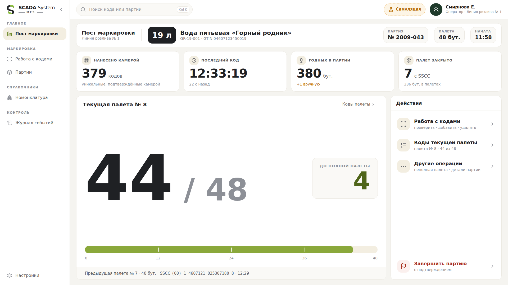
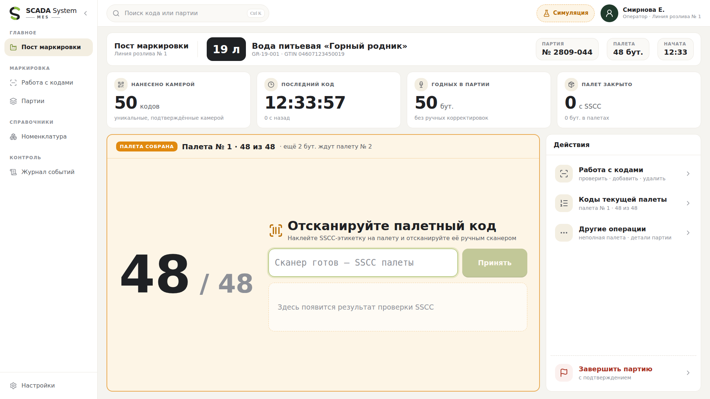
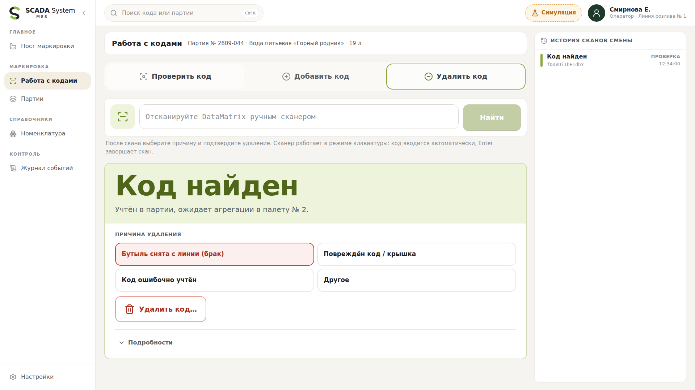
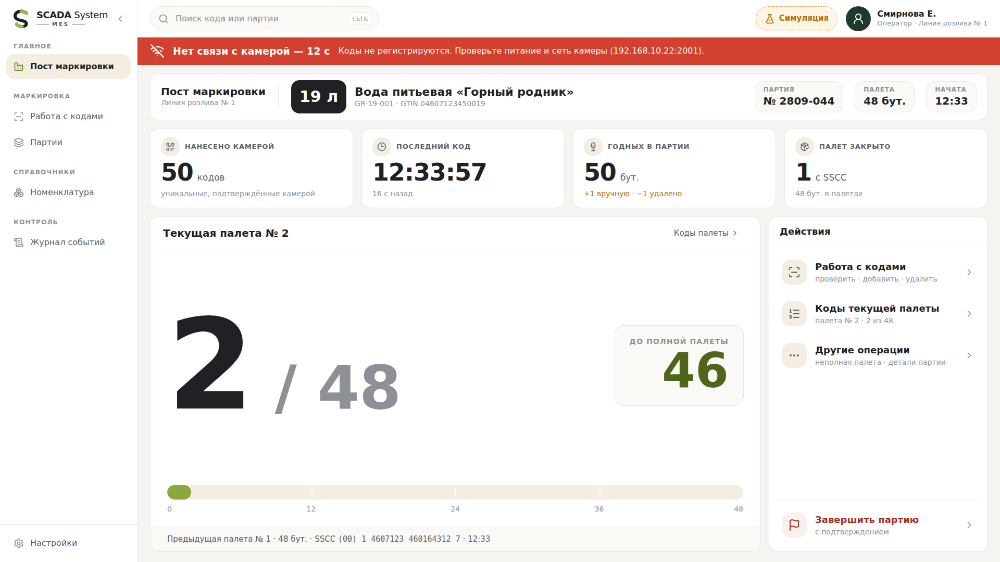
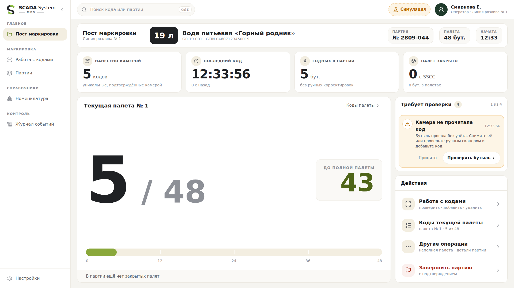

# SCADA System MES — «Пост маркировки» (АРМ оператора маркировки и агрегации)

Интерфейс оператора линии маркировки бутылей 19 л и 11 л. Маршрут `/mes`.

```bash
npm ci && npm run dev                 # http://localhost:3000/mes
npm run test:mes                      # доменная модель: FIFO, счётчики, SSCC, корректировки
npm run build && npm start            # затем в другом терминале:
npm run test:mes:e2e                  # три сценария оператора в браузере (Playwright)
```



## Модель производства

```
камера ──► уникальный подтверждённый DataMatrix ──► FIFO партии
FIFO[0 … N−1] = текущая группа агрегации, N = 36 или 48
FIFO ≥ N  ──► «Палета № K собрана. Отсканируйте палетный код»
SSCC прошёл проверку ──► первые N кодов связаны с SSCC, палета закрыта, K + 1
```

- В системе одна камера и нет датчиков положения. Физическая раскладка бутылей на палете не отслеживается и на экране не изображается.
- Бутыли, считанные во время ожидания SSCC, остаются в FIFO после группы и уходят в следующую палету («+2 в очереди на палету № 9»). Выдуманного «накопителя» и остановки конвейера нет: интеграции с ПЛК пока нет.
- Связь с камерой определяется по heartbeat, а не по потоку кодов. Простой линии предупреждения не вызывает. Если камера не отвечает дольше таймаута (по умолчанию 10 с), появляется красное сообщение с причиной и адресом камеры.
- Пока реальной интеграции нет, прототип работает на **симуляции** (кнопка «Симуляция» в верхней панели). Симуляция генерирует события камеры и ручного сканера по той же FIFO-модели и отделена от рабочего интерфейса.

## Счётчики главного экрана

| Показатель | Определение | Что меняет ручная корректировка |
|---|---|---|
| Бутылей в текущей палете | `min(FIFO, N) из N` | Удаление: −1. Добавление: код встаёт в конец FIFO |
| Нанесено кодов | Уникальные коды, подтверждённые камерой в партии | Не меняется: это факт камеры |
| Всего бутылей в партии | Нанесено + добавлено вручную − удалено | ±1. Корректировки показаны под числом |
| Палет агрегировано | Закрытые палеты с подтверждённым SSCC | — |
| Последнее нанесение | Время последнего кода, подтверждённого камерой, и «N с назад» | Не меняется от ручного добавления |

Инвариант «всего бутылей = бутылей в закрытых палетах + длина FIFO» проверяется тестами после каждого действия.

## Проверки

**SSCC** (подтверждение палеты):
- формат: 18 цифр, (00);
- контрольная цифра GS1;
- код не присвоен другой палете;
- палета собрана.

Повторный скан только что закрытой палеты ничего не меняет и показывает «Повторный скан». Повторного закрытия не бывает.

**Ручной сканер**. USB HID Keyboard, скан завершается Enter, после скана фокус возвращается в поле. Разделитель GS может отсутствовать — код всё равно распознаётся.
- **Проверить** — крупно: «Код найден», «Не зарегистрирован», «Уже агрегирован», «Удалён», «Чужая номенклатура», «Другая партия». Полный код, время регистрации, палета и SSCC — в раскрываемых «Подробностях».
- **Добавить** — проверяются формат, номенклатура (GTIN), партия и дубликат. Допустимый код встаёт в конец FIFO.
- **Удалить** — причина обязательна, затем подтверждение. Код из закрытой палеты простым удалением не убирается: нужна корректировка агрегации (расформирование палеты мастером, в прототипе не реализовано).

**События камеры, требующие действия** (подтверждаются кнопкой «Принято»):
- NoRead;
- повторный код;
- код другой номенклатуры.

Такие бутыли не учитываются.

## Экраны

| Экран | Назначение |
|---|---|
| Пост маркировки | Шапка партии, счётчики «Нанесение · Учёт · Агрегация», текущая палета и приём SSCC, контекстные действия |
| Коды | Проверить / добавить / удалить код ручным сканером, история сканов смены |
| Партии | История, корректировки, коды без палеты, закрытые палеты с SSCC |
| Номенклатура, Журнал, Настройки | Справочник, полный журнал событий, параметры линии, палеты, камеры и сканера |

| Палета собрана — ждём SSCC | Корректировка: удаление кода |
|---|---|
|  |  |
| **Нет связи с камерой** | **События камеры** |
|  |  |

## Код

| Файл | Содержимое |
|---|---|
| `components/mes/domain.ts` | Модель, reducer, проверки SSCC и DataMatrix, инварианты, демо-данные (без React) |
| `components/mes/store.tsx` | React-провайдер, симулятор камеры и heartbeat |
| `components/mes/shell.tsx` | Верхняя панель, навигация, перехват HID-сканера, панель симуляции |
| `components/mes/screens/*` | Экраны |
| `scripts/mes-scenarios.mjs` | Тесты доменной модели |
| `scripts/mes-e2e.cjs` | Браузерные сценарии и скриншоты |
