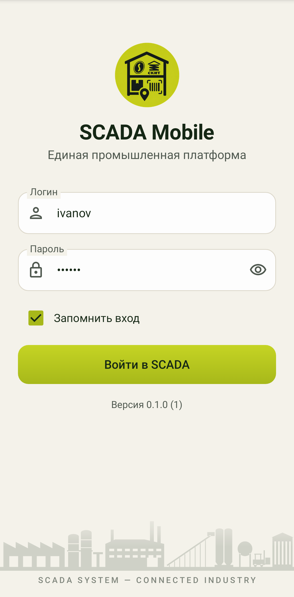
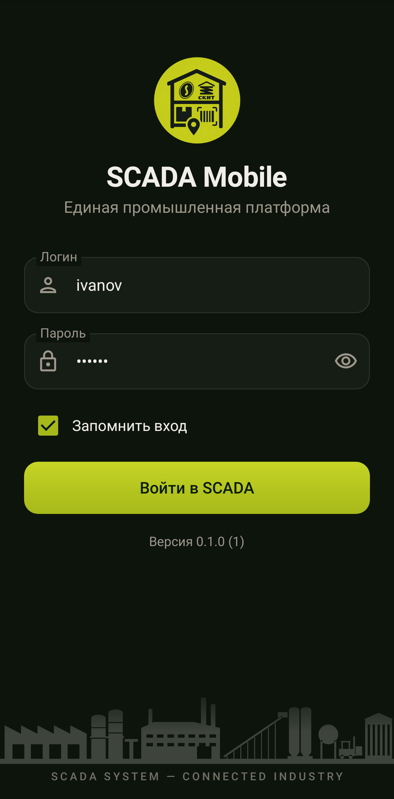
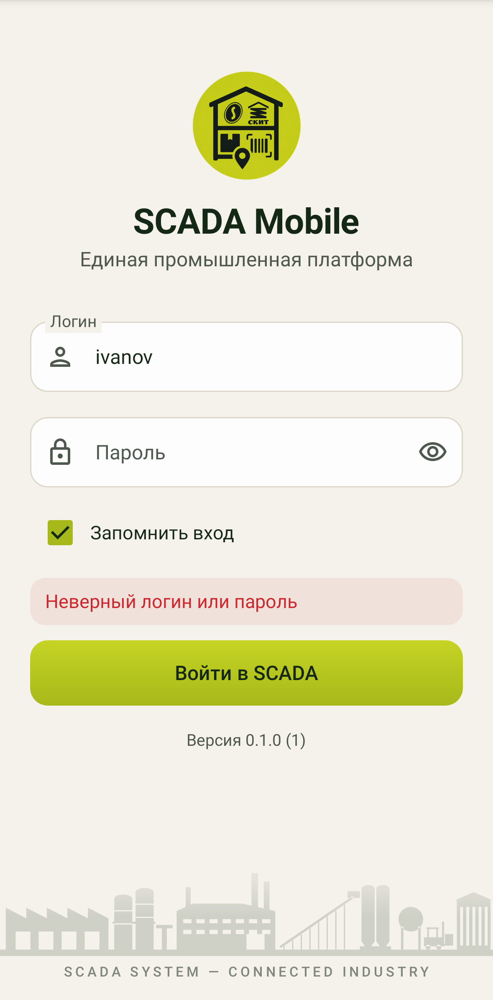
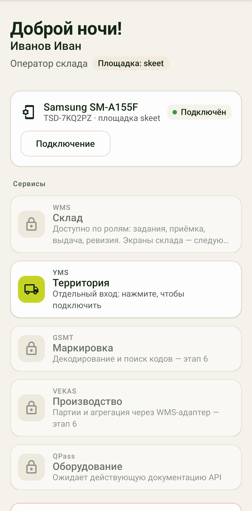

# SCADA Mobile

Нативный Android-клиент экосистемы SCADA System: Kotlin, Jetpack Compose, Material 3,
MVVM + Clean Architecture, Coroutines/StateFlow, Retrofit + OkHttp, Hilt, Android Keystore.
Работает с реальными API WMS и YMS — без моков и параллельного backend.

Контракты и решения по ним: [docs/CONTRACT.md](docs/CONTRACT.md).

## Состояние

| Этап | Что есть | Проверено |
|---|---|---|
| 1. Фундамент | Gradle multi-module, тема Light/Dark из токенов SCADA WMS, UI-kit (12 компонентов), сетевой слой (WMS/YMS клиенты, перехватчики, ошибки, безопасные повторы), DI | `./gradlew assembleDebug` собирает APK; 30 JVM-тестов |
| 2. Авторизация | экран входа с анимацией и промышленной панорамой, реальный `POST /api/auth/login`, сессия в Keystore, проверка `/api/auth/me`, выход, истечение (401), офлайн-запуск, «Запомнить вход» | логика — тестами на MockWebServer; экраны — рендер-тестами (Robolectric + Roborazzi) |
| 2+. Подключения | «Подключить устройство» (`/api/wms/devices/enroll`), отдельный вход YMS (cookie) | логика — тестами |
| 3–7 | рабочее пространство пока временное (без нижней навигации и заданий) | — |

Не проверено: запуск на реальном телефоне и вход на боевых серверах (из среды
сборки они недоступны).

   

## Модули

```
app/                  Application, MainActivity, навигация, DI (Hilt)
core/common           (JVM) роли, площадка, GS1-разбор, ошибки, защита от повторных сканов
core/network          (JVM) DTO, Retrofit API, WmsApiClient / YmsApiClient, перехватчики
core/data             (JVM) AuthRepository, DeviceRepository, YmsConnection
core/security         (Android) Keystore AES-GCM, зашифрованные хранилища сессии, устройства, cookie YMS
core/designsystem     (Android) тема SCADA, UI-kit, панорама, рамка сканера
feature/login         экран входа
feature/home          рабочее пространство, подключение устройства, вход YMS
```

## Сборка

Нужны JDK 17+ и Android SDK (platform 35, build-tools 34+).

```bash
cd scada-mobile
./gradlew :app:assembleDebug            # APK: app/build/outputs/apk/debug/app-debug.apk
./gradlew test                          # JVM-тесты + рендер экранов в docs/screens/
./gradlew -Pscada.jvmOnly test          # только тесты контрактов, сети и репозиториев (без Android SDK)
```

Другой адрес сервера: `./gradlew :app:assembleDebug -Pscada.wmsUrl=https://wms.example/ -Pscada.ymsUrl=https://yms.example/`.

## Безопасность

* Пароль не сохраняется. Токен сессии, токен устройства и cookie YMS — в файлах
  `noBackupFilesDir`, зашифрованных ключом Android Keystore; исключены из резервных копий.
* Bearer WMS и X-Device-Token не смешиваются (разные маршруты), Bearer не уходит в YMS.
* Сетевой журнал — только в debug и без заголовков, параметров и тел.
* Только HTTPS, пользовательские сертификаты не доверяются.
* POST не повторяется автоматически; мутации заданий идут с `requestId`.
