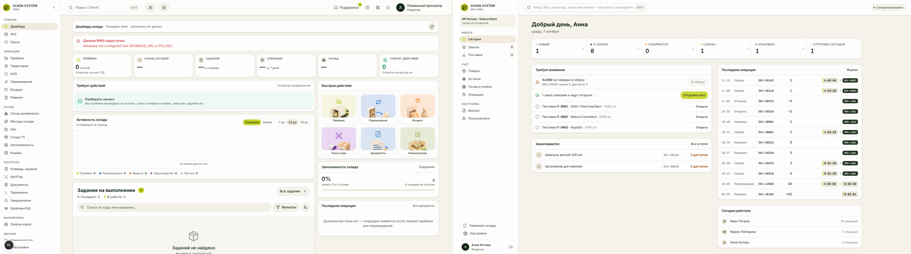
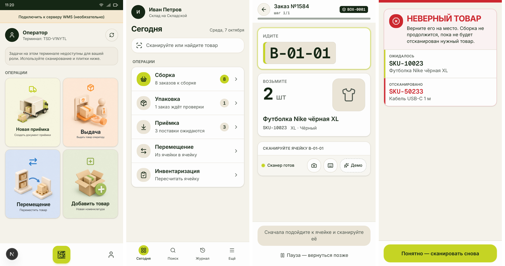
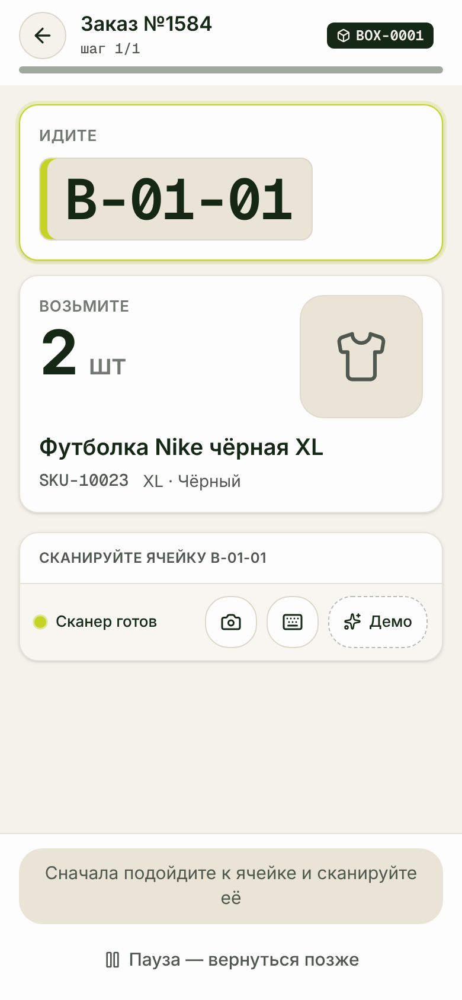
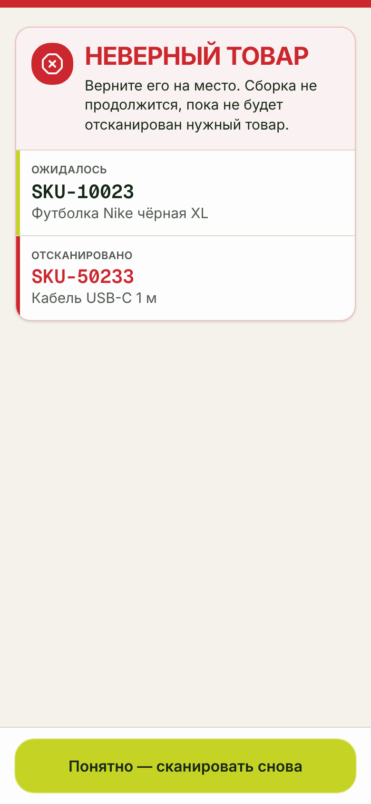
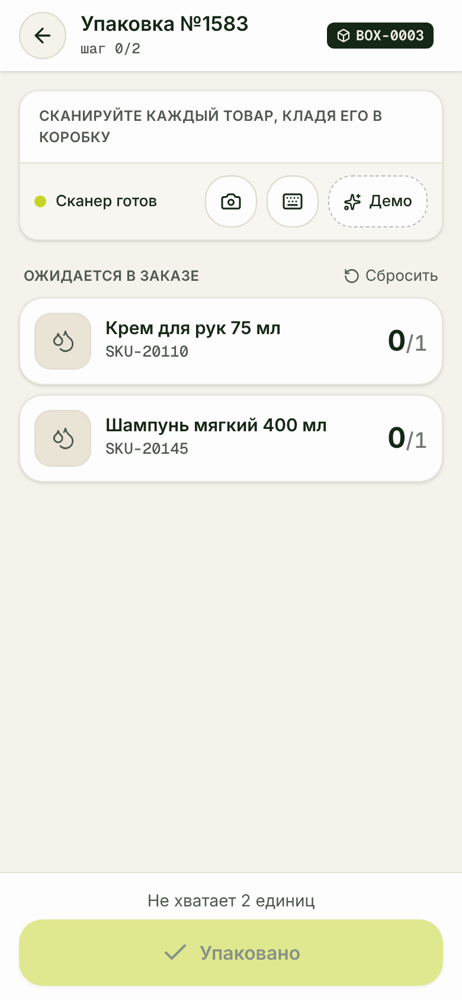
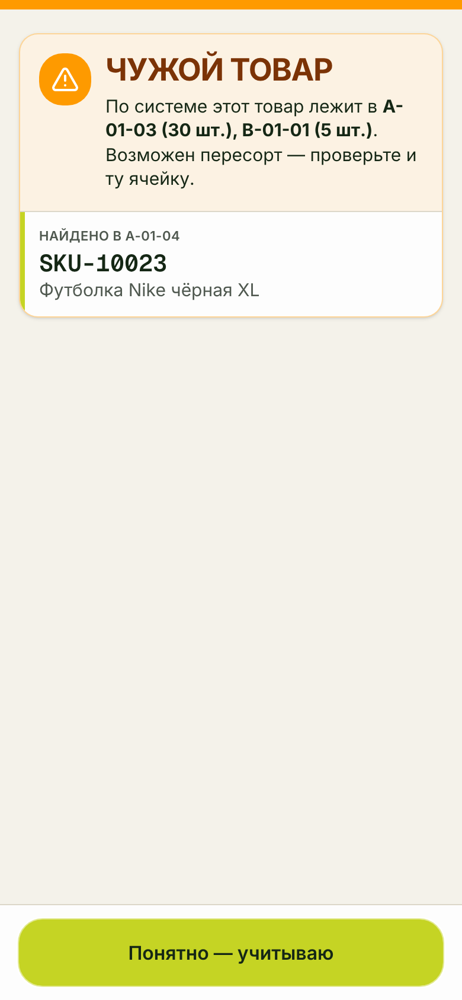
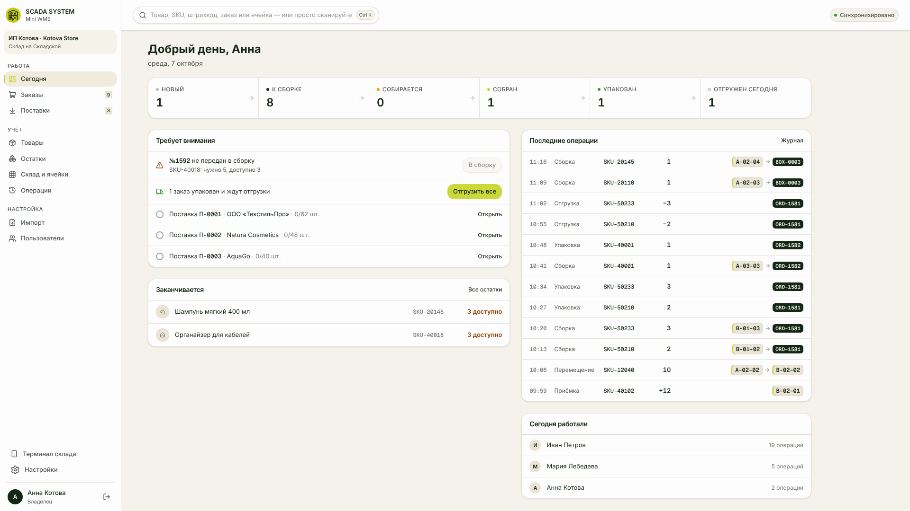

# SCADA Mini WMS

**Телефон уже является вашим ТСД.** Облачная WMS для небольших селлеров Wildberries, Ozon,
Яндекс Маркета и интернет-магазинов: складской учёт и защита от пересорта без покупки
терминалов, 1С и интегратора.

Это кликабельный MVP: полноценный фронтенд (PWA) с доменной логикой, которая работает в
браузере так же, как будет работать сервер. Архитектура, модули и план бэкенда —
[docs/ARCHITECTURE.md](docs/ARCHITECTURE.md), схема PostgreSQL —
[backend/schema.sql](backend/schema.sql).

## Запуск

```bash
cd scada-wms
npm install
npm run dev            # http://localhost:5173
```

Откройте `/login` и войдите как **Анна** (владелец, кабинет) или **Иван** (кладовщик,
терминал). Демо-склад уже заполнен товарами, ячейками, заказами и поставками. Свой склад
с нуля — «Создать склад» (онбординг на 5 шагов).

Без этикеток и сканера: на каждом шаге есть кнопка **«Демо-скан»** со списком подходящих
и заведомо неверных кодов. USB/Bluetooth-сканер работает сразу (режим клавиатуры), камера —
по нажатию на видоискатель. Терминал удобно смотреть в DevTools в режиме телефона.

## Дизайн-система

Mini WMS — младший модуль **SCADA System WMS** и использует её дизайн-систему, а не свою:

* токены (`--background`, `--primary`, `--border`, `--radius`, …), `@theme inline` и классы
  `.wms-panel`, `.wms-metric-*`, `.wms-ag-grid` **копируются дословно** из
  `writehost/scada_system/app/globals.css` в `src/theme/scada-system.css` скриптом
  `node scripts/sync-scada-theme.mjs <путь к scada_system>` — файл не редактируется руками;
* шрифты те же: Inter + Geist Mono;
* кнопки, поля, бейджи статусов, сайдбар, шапка и мобильная навигация повторяют
  `components/ui/button.tsx`, `input.tsx`, `components/wms/sidebar.tsx`, `header.tsx`, `app/mobile/layout.tsx`;
* логотип — `logowmsscada.png` основного WMS.

Своих цветов нет. Единственное дополнение — `--success` / `--warning`, которые основной WMS
объявляет в `:root`, но не пробрасывает в Tailwind.



*Слева — дашборд основного SCADA System WMS, справа — кабинет Mini WMS.*



*Слева направо: ТСД основного WMS, главная Mini WMS, сборка, ошибка «Неверный товар».*

## Экраны

| Телефон — терминал `/m` | Компьютер — кабинет `/app` |
|---|---|
| Сегодня, приёмка (по поставке / быстрая), сборка (ячейка → товар → количество), упаковка со сверкой, перемещение, инвентаризация, поиск по скану, журнал, настройки и офлайн | Сегодня, заказы, поставки, товары, остатки, склад и ячейки (+ PDF QR), короба, журнал операций, импорт CSV, пользователи, настройки и тарифы |

<p>




</p>


## Проверки

```bash
npm test                 # доменные тесты (vitest): ключевой сценарий, резерв, изоляция организаций
npm run build
npx vite preview --port 4173 &
npm run e2e              # ключевой сценарий end-to-end в Chromium: владелец 1920×1080 + кладовщик 390×844
npm run shots            # скриншоты всех экранов 390×844, 430×932, 1920×1080 + проверка горизонтального переполнения
```

Ключевой сценарий (`e2e/key-scenario.mjs`): владелец создаёт товар и ячейки A-01-01/A-01-02,
скачивает PDF с QR → кладовщик на телефоне принимает 20 шт. в A-01-01 → заказ на 2 шт. →
сборка «A-01-01, возьмите 2» → неверная ячейка и неверный товар блокируются красным экраном
без обхода → правильный товар → упаковка ловит лишний товар и недостачу → «Упакован».

## Стек

React 19 + TypeScript + Vite + Tailwind 4, PWA (manifest + service worker), `qrcode` +
`jspdf` для этикеток, `BarcodeDetector` / ZXing для камеры. Дизайн-токены и шрифты (Inter, Geist Mono) — из SCADA System WMS.
Бэкенд по плану — modular monolith (FastAPI или Django) + PostgreSQL с RLS; без Kafka,
Kubernetes, Elasticsearch и микросервисов.

## Структура

```
src/theme/      токены SCADA System WMS (генерируется scripts/sync-scada-theme.mjs)
src/domain/     типы, транзакционное хранилище, сервисы (вся бизнес-логика), тарифы, коннекторы
src/scan/       камера, HID-сканер, полноэкранные результаты скана
src/mobile/     терминал склада
src/desktop/    кабинет владельца
src/pages/      лендинг, вход/регистрация, онбординг
backend/        схема PostgreSQL
docs/           архитектура, скриншоты
e2e/            сквозной сценарий и скриншоты (playwright-core)
```
